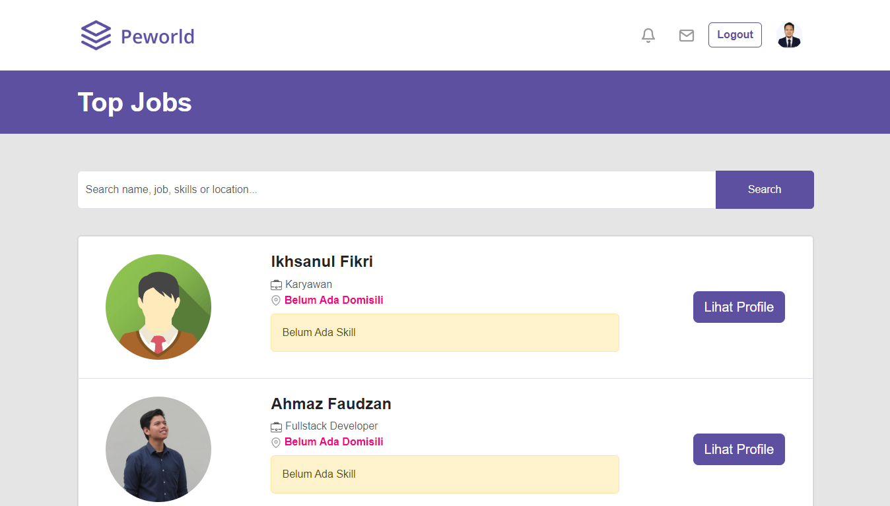

# Hire Job Website App

Frontend for Hire Job built with NextJS.


Hire Job Front-End is a website interface for Hire Job Back-End.

- Search for Jobs
- Page Contain List of Jobs
- Profile User and Edit Profile User
- Hire / Contact Page
- Pages for Authentication and Authorization

## Tech

Hire Job Front-End uses a number of open source projects to work properly:

- [NextJS](https://nextjs.org/) - frontend framework

And of course Hire Job Front-End itself is open source with a [public repository](https://github.com/alkarim99/hire-job-fe-next) on GitHub.

## Installation

Hire Job Front-End able to run on your local, download this repo and open it using visual studio code, and run the terminal like below.

```sh
cd hire_job
npm i
npm run dev
```

## Screenshot

1. Landing Page <br>
   
   
   
2. Job Lists <br>
   
3. Contact / Hire Page <br>
   
4. Profile Page <br>
   
5. Edit Profile Page <br>
   
6. Edit Photo Profile and Skills <br>
   
7. Edit Experience <br>
   
8. Login Page <br>
   
9. Register Page <br>
   
